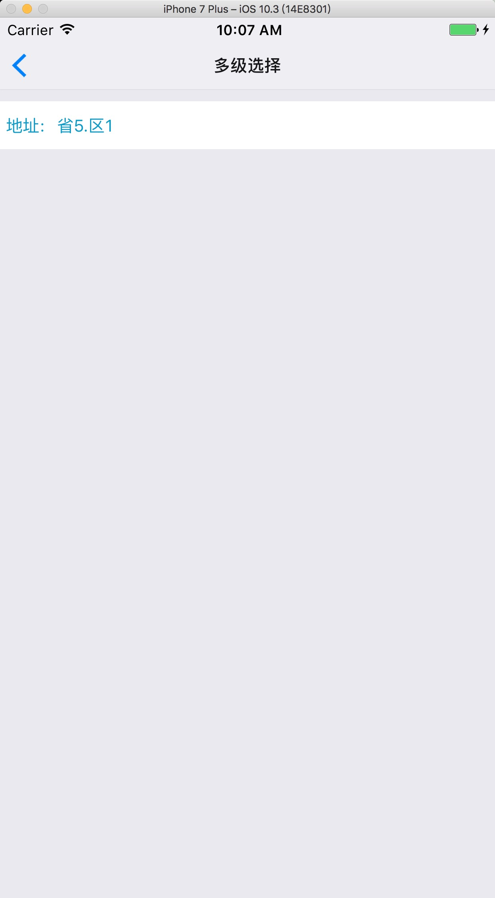
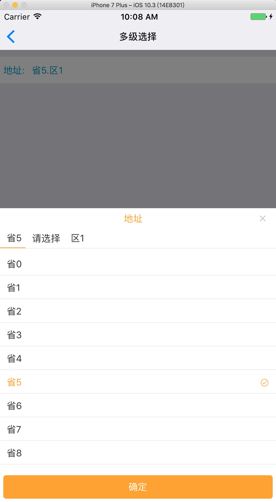

[TOC]
# tzbbLibs
>tzbb脚手架依赖资源包

## workbench
>tzbb脚手架基础底座

### workbench API
#### 1. 引用方法（脚手架主项目已整合，可以忽略）


####  2. 级联选择框
>有标题 有文本框长酱样儿




##### 2.1 demo
```
/**
 *   Copyright 2007-2017 by DHC Software co.
 *   创建人：dreamsleep
 *   联系方式：
 *   创建时间：2017-09-07 13:31
 *   简介：
 *   路由：
 *   更改历史：
 *   更改人|更改时间|更改内容|代码位置编号|
 */
'use strict';

import React, {Component} from 'react';
import MultSelecterOptionModal from "../../cores/uiModules/MultSelecterOptionModal"

import {
    StyleSheet,
    View,
} from 'react-native';
import MultSelecter from "../../cores/uiModules/MultSelecter"

/**
 * @mark 文件内变量
 */

//文件内变量结束
const optionItems = [{
    key: "province", itemGetter: (opt) => {
        // console.warn("ccccccc" + JSON.stringify(opt))
        var arr = [];
        for (var i = 0; i < 10; i++) {
            arr.push({code: "province" + i, name: "省" + i});
        }
        return arr;
    }, id: "code", show: "name", formatShow: (item) => {
    }, defaultSelected: () => {
        return {code: "province5", name: "省5"}
    }
}, {
    key: "city", itemGetter: (opt) => {
        // console.warn("ccccccc" + JSON.stringify(opt))
        var arr = [];
        for (var i = 0; i < 10; i++) {
            arr.push({code: "city" + i, name: "城市" + i});
        }
        return arr;
    }, id: "code", show: "name", formatShow: (item) => {
    }, defaultSelected: () => {
        return null
    }
}, {
    key: "district", itemGetter: (opt) => {
        // console.warn("ccccccc" + JSON.stringify(opt))
        var arr = [];
        for (var i = 0; i < 10; i++) {
            arr.push({code: "district" + i, name: "区" + i});
        }
        return arr;
    }, id: "code", show: "name", formatShow: (item) => {
    }, defaultSelected: () => {
        return {code: "district1", name: "区1"}
    }
}]
export default class MultSelecterDemo extends React.Component {

    /***
     * default props value
     * @mark propTypes 默认属性值
     */
    static defaultProps = {}

    /***
     * props types for helper text
     * @mark propTypes 属性类型
     */
    static propTypes = {}

    /**
     * @mark state
     */
    state = {}

    /**
     * @mark constructor
     */
    constructor(props) {
        super(props);
    }

    /**
     * @mark 组件声明周期区域
     */

    /**
     * @mark 第一次加载 只运行一次
     */
    componentDidMount() {

    }

    //声明周期代码结束

    /**
     * @mark 自定义代码区
     */
    getMultSelecterOptionModal() {
        return this.refs['MultSelecterOptionModal'];
    }

    //自定义代码区结束

    /**
     * @mark render
     */
    render() {
        return <View style={styles.MultSelecterDemo}>
            <MultSelecter contextStyle={styles.multSelecter}
                          valueContextStyle={{borderRadius: 4, paddingLeft: 0, borderWidth: 0}}
                          titleStyle={{color: "#0099cc"}}
                          valueTextStyle={{color: "#0099cc", marginLeft: 0}} selectedColor="orange"
                          showTitle="地址:"
                          showValue="请选择"
                          separator="."
                          optionModal={this.getMultSelecterOptionModal.bind(this)}
                          optionItems={optionItems}
                          onSelected={(selectedValues) => {
                              console.warn(JSON.stringify(selectedValues))
                          }}/>
            <MultSelecterOptionModal ref="MultSelecterOptionModal"/>
        </View>
    }
}

//@mark style
const styles = StyleSheet.create({
    MultSelecterDemo: {
        flex: 1,
        paddingTop: 10
    },
    multSelecter: {
        height: 40,
    }
});
```

##### 属性

| 名称 | 类型 | 介绍  |
| --- | --- | --- |
| contextStyle | StyleSheet | 最外层View样式  |
| valueContextStyle | StyleSheet | 值显示区域样式  |
| titleStyle | StyleSheet | 标题text样式  |
| valueTextStyle | StyleSheet | 值text样式  |
| showTitle | String | 显示标题  |
| showValue | String | 默认显示值 |
|separator|String|及联显示分隔符|
|selectedColor|String(颜色编码)|选中项颜色编码|
|onSelected|function|选择结束回调 默认参数  selectedValues|

##### 注意

```
 <MultSelecterOptionModal ref="MultSelecterOptionModal"/>
```

```
    /**
     * @mark 自定义代码区
     */
    getMultSelecterOptionModal() {
        return this.refs['MultSelecterOptionModal'];
    }
```


